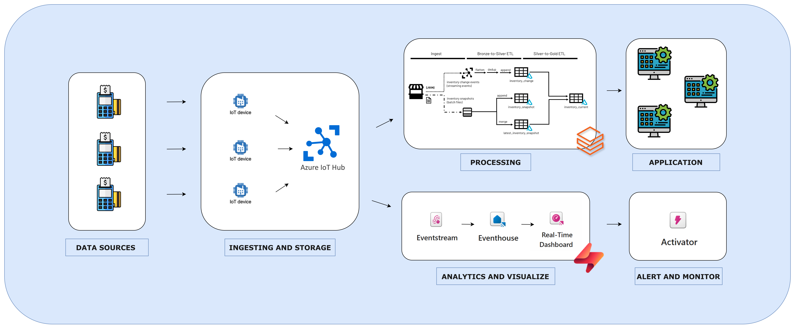

# pos-realtime-inventory-with-fabric-n-DLT

## Overview

Point-of-Sale Streaming with Delta Live Tables (DLT) là một giải pháp ứng dụng Delta Live Tables để xây dựng kiến trúc lakehouse gần real-time nhằm tính toán lượng hàng tồn kho hiện tại cho nhiều sản phẩm tại các địa điểm cửa hàng khác nhau. Thay vì chuyển trực tiếp từ dữ liệu raw đã được ingest sang lượng tồn kho đã tính toán, giải pháp này chia logic thành hai giai đoạn riêng biệt.

### Ở phần Databrick
Trong giai đoạn đầu (Bronze-to-Silver ETL như được minh họa trong hình), dữ liệu đã ingest được transform để dễ truy cập hơn. Các hành động được thực hiện trên dữ liệu ở giai đoạn này, chẳng hạn như decomposing các nested arrays, deduplication các bản ghi, v.v.,. Các bảng được ghi vào ở giai đoạn này đại diện cho layer Silver của kiến trúc lakehouse [medallion architecture](https://databricks.com/glossary/medallion-architecture).

Trong giai đoạn tiếp theo (Silver-to-Gold ETL như được minh họa trong hình), các bảng Silver được sử dụng để tạo ra các đầu ra phù hợp với yêu cầu kinh doanh, cụ thể là tính toán lượng tồn kho hiện tại. Dữ liệu này được ghi vào bảng đại diện cho layer Gold của kiến trúc.

### Phần Fabric
Dữ liệu được ghi nhận trong IOT Hub, và cũng được stream vào Microsoft Fabric để phục vụ cho việc Visualize và phân tích.

Eventstream: Nhận dữ liệu real-time từ IotHub và chuyển đổi để sử dụng trong các ứng dụng downstream.

Eventhouse: Lưu trữ dữ liệu đã xử lý, tạo nền tảng để xây dựng báo cáo và phân tích chuyên sâu.

Real-Time Dashboard: Sử dụng dữ liệu đã xử lý để hiển thị thông tin tồn kho một cách trực quan, giúp các nhà quản lý theo dõi và tối ưu hóa hoạt động kinh doanh.

